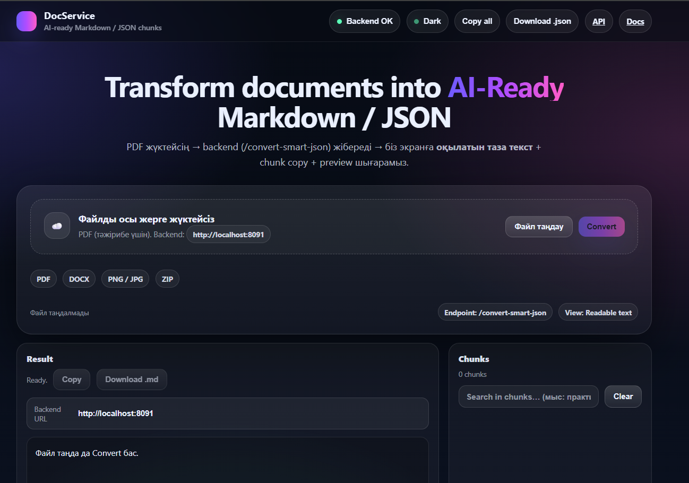
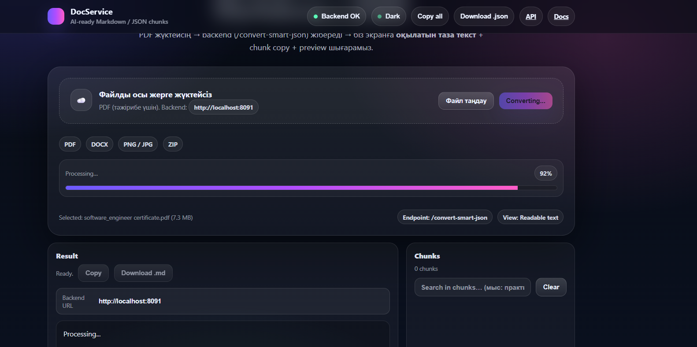
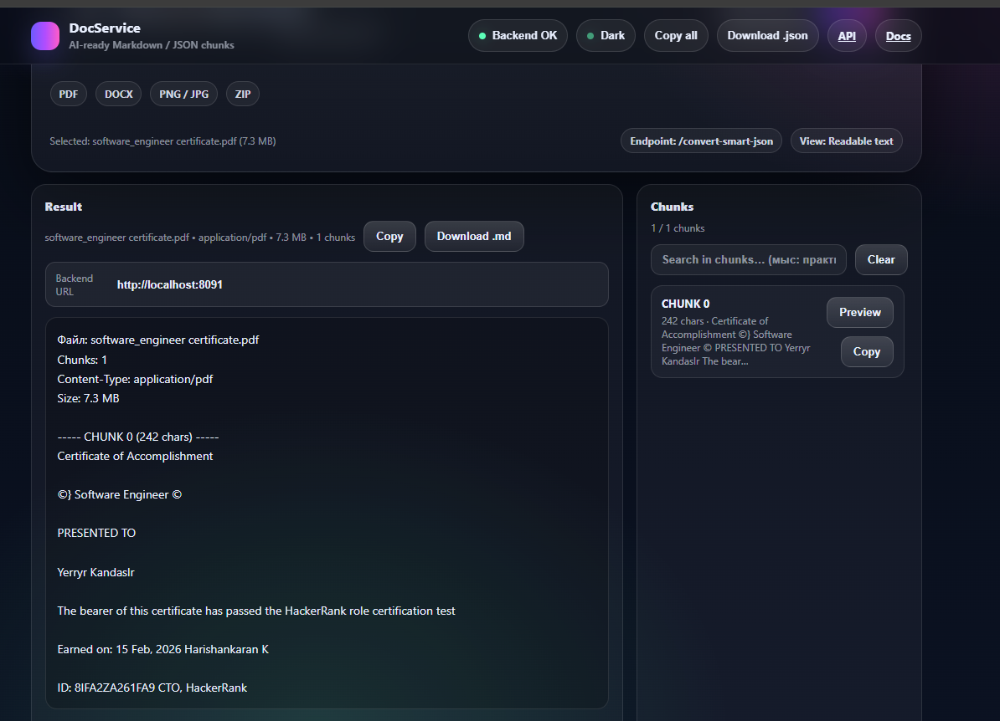

# 📄 DocService

A Spring Boot-based document processing backend service built with Docker and cloud deployment configuration.

---

## 🚀 Overview

DocService is a backend REST API designed for document handling and processing.  
The project demonstrates:

- Spring Boot backend architecture
- Maven build system
- Docker containerization
- Cloud deployment configuration (Koyeb)
- Dynamic port handling for production environments

---

## 🛠 Tech Stack

- Java 17
- Spring Boot
- Maven
- Docker
- GitHub
- Cloud Deployment (Koyeb)

---

## 🏗 Architecture

```
Client → REST API (Spring Boot) → Service Layer → Processing Logic
```

The application is containerized using Docker and configured to run on dynamic cloud ports.

---

## 🐳 Docker Setup

The service runs using:

```dockerfile
FROM eclipse-temurin:17-jdk
WORKDIR /app
COPY . .
RUN chmod +x mvnw
RUN ./mvnw clean package -DskipTests
EXPOSE 8000
CMD ["sh", "-c", "java -jar target/docservice-0.0.1-SNAPSHOT.jar --server.port=$PORT"]
```

---

## ☁ Cloud Deployment

Configured for cloud platforms using:

```
server.port=${PORT}
```

Supports dynamic port allocation for production environments.

---

## 📸 Screenshots

### 🔹 Application Build


### 🔹 File processing progress


### 🔹 File reading result


---

## 🎯 What This Project Demonstrates

- Backend API design
- Containerization
- CI/CD readiness
- Cloud deployment preparation
- Production configuration knowledge

---

## 📌 Future Improvements

- Add persistent storage
- Add Swagger documentation
- Implement authentication
- Deploy to VPS for full production hosting

---

## 👨‍💻 Author

Ernur Kanash  
Backend Developer (Java / Spring Boot)
